Learned the basic commands for working in the terminal. turned out to be very useful. Now it is necessary to consolidate everything in practice in order to sharpen the speed and store it well in the memory

It will be exciting if everything works out the first time

### General
- [x] 0. Git Basics
- [x] 1. Linux CLI and Networking
- [x] 2. Git Collaboration
- [x] 3.Intro to HTML and CSS

## Linux CLI, and HTTP

More info...

It was very interesting. Almost all things were new to me.

I realized that with the help of commands I can manage any process.

It will be very necessary in further work, especially with the terminal, when working with Git

## Git Collaboration

More info...

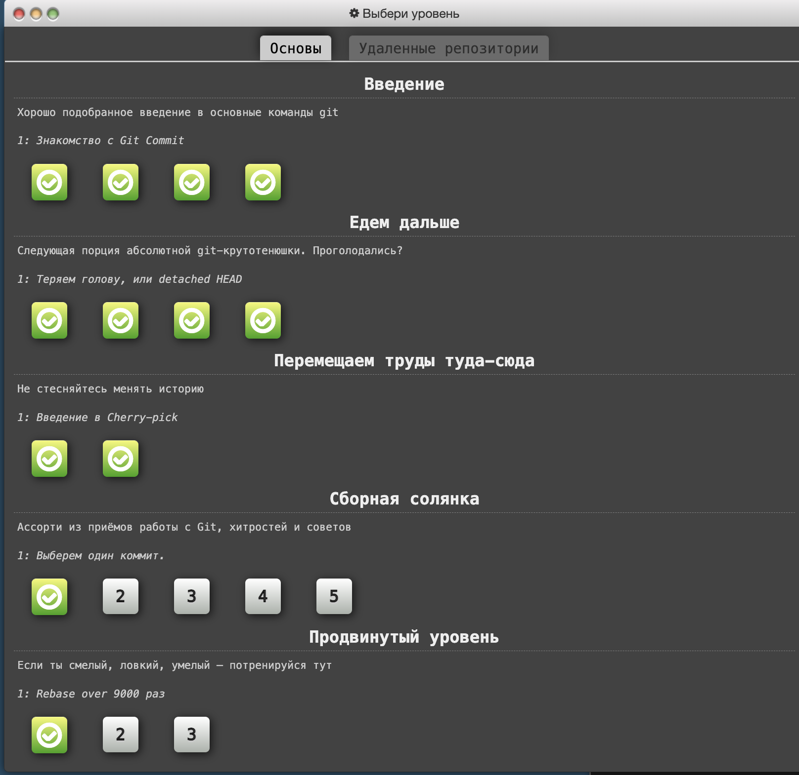
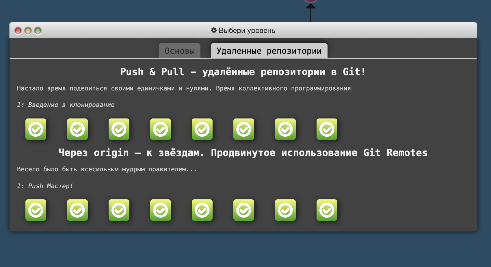

### Introduction to Git and GitHub

More info...

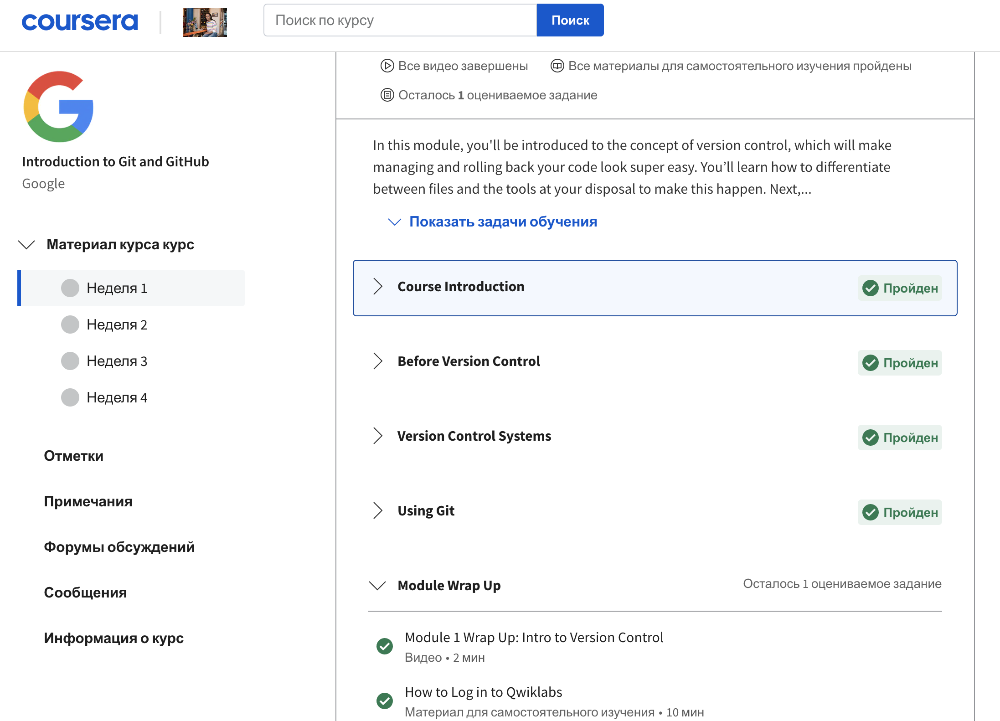
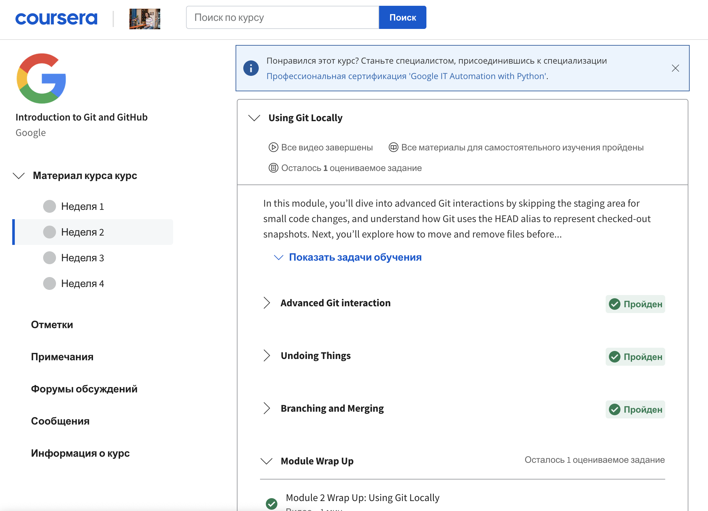
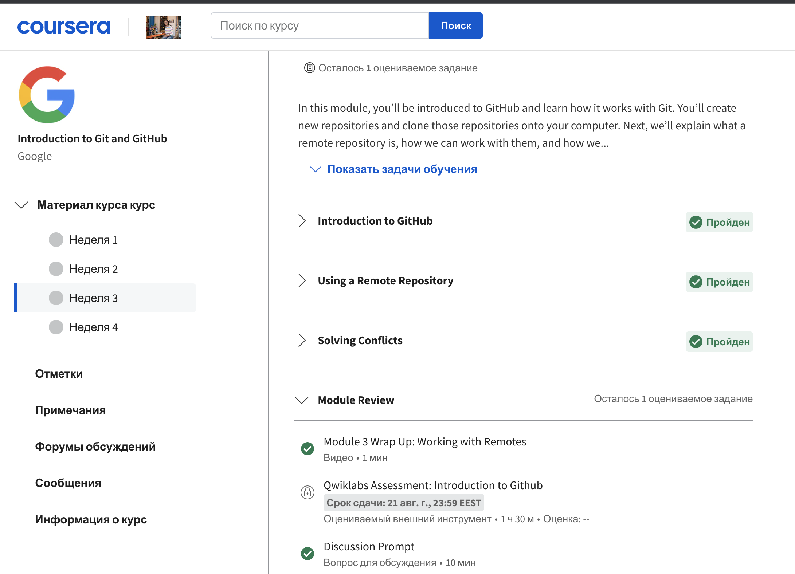
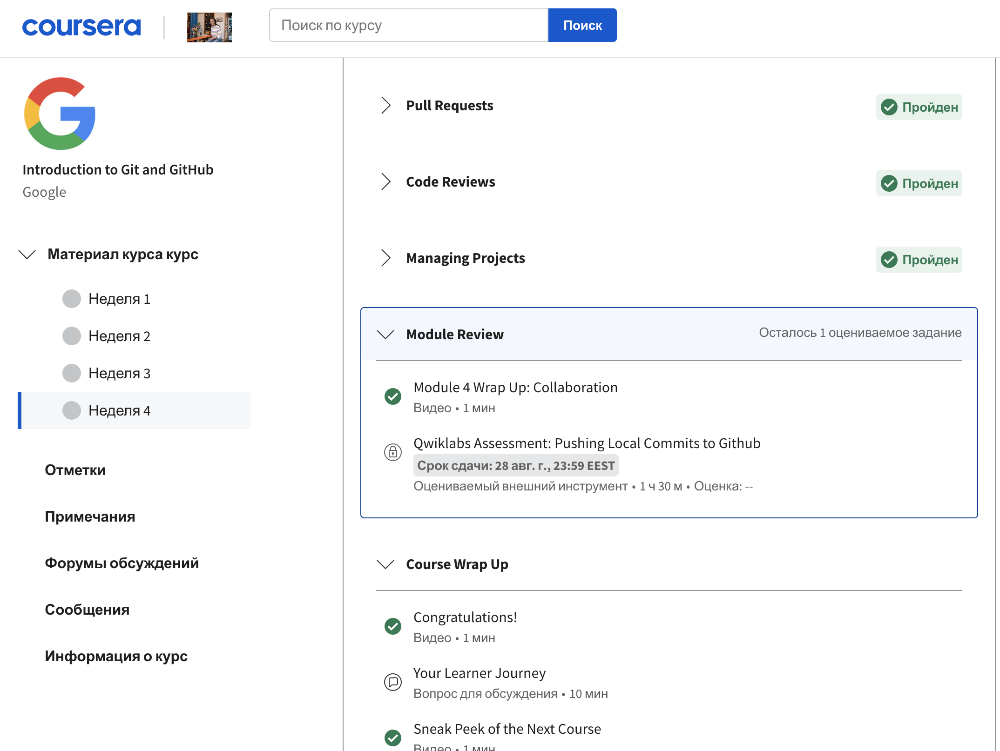

On the Coursera course, it was interesting and intelligibly explained the theory, and it turned out to be well consolidated in practice, on the learngitbranching.com website

## Intro to HTML and CSS

More info...

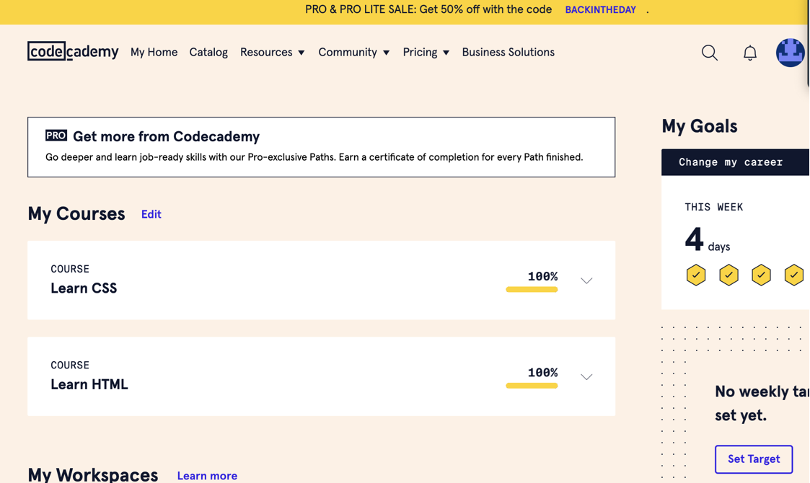
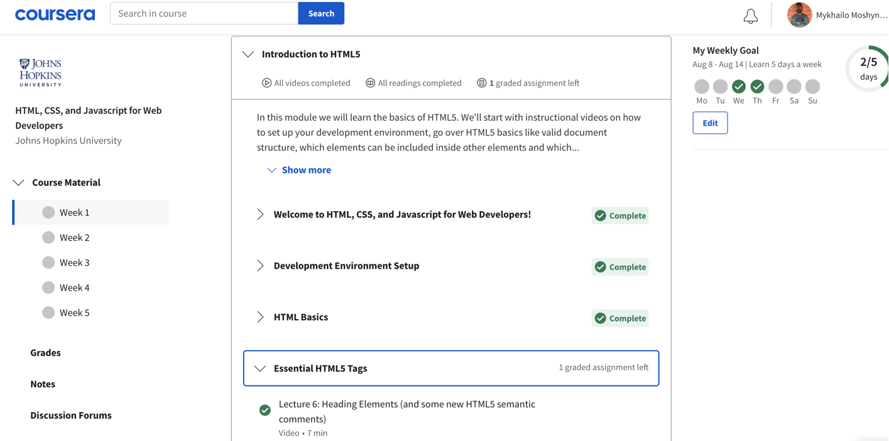
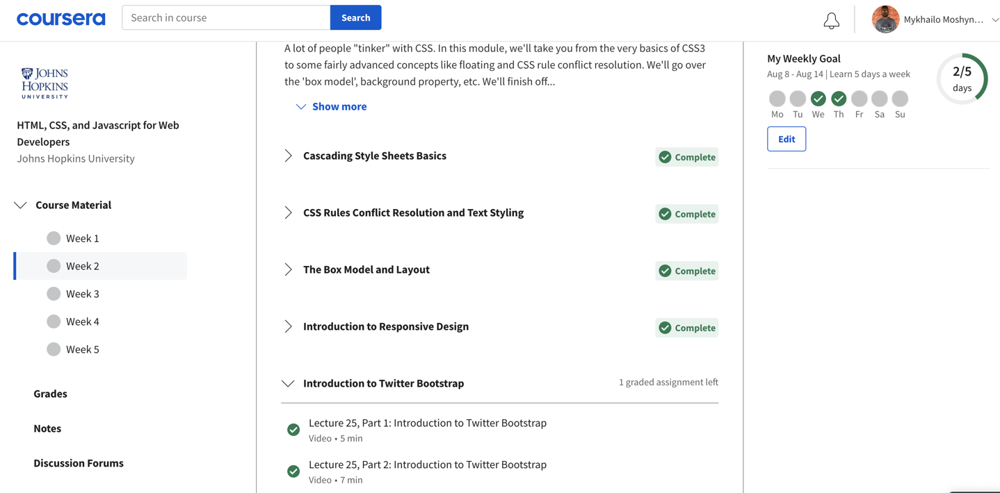

I learned new things for myself working with <figure> and <figcaption> come in.

Refreshed knowledge about box-model, positioning

Better understood about Responsive design

## Responsive Web Design

More info...

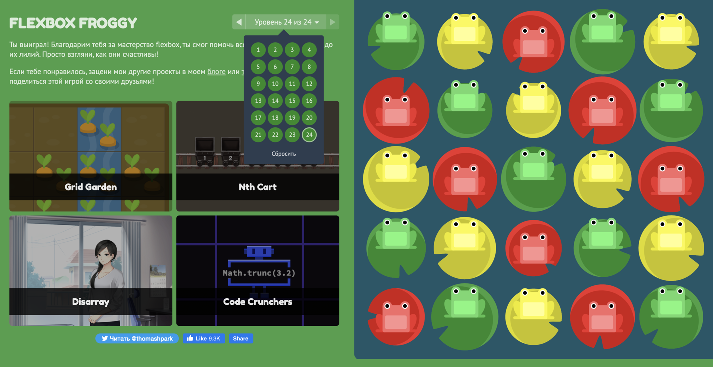
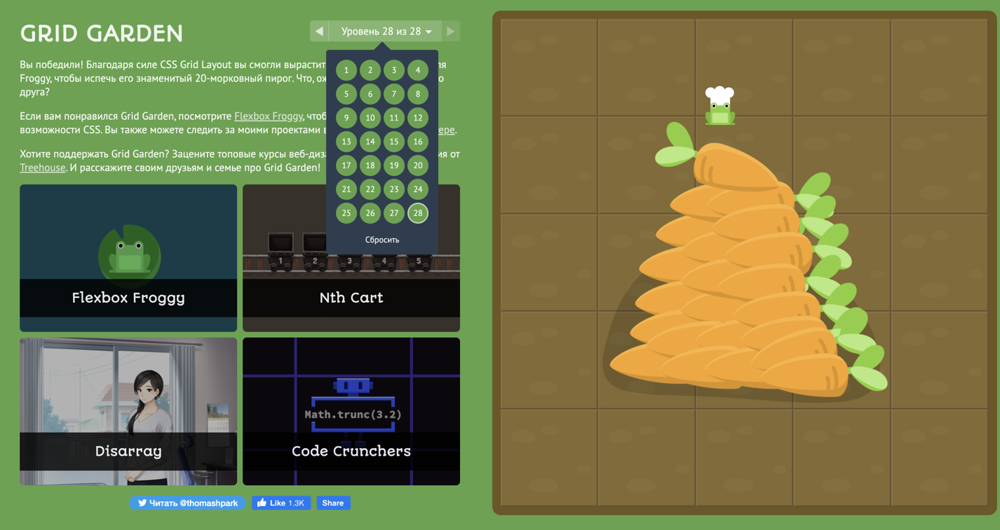

Expanded skills in working with Flex-box

I learned how to work with Grid, it was new for me. I realized how convenient it is to use and how I can create beautiful designs with it

The lessons on the youtube channel are very useful, they explain everything in an accessible way. I want to put my knowledge into practice

